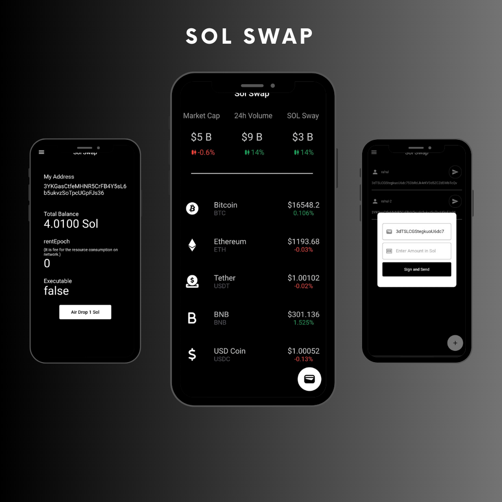
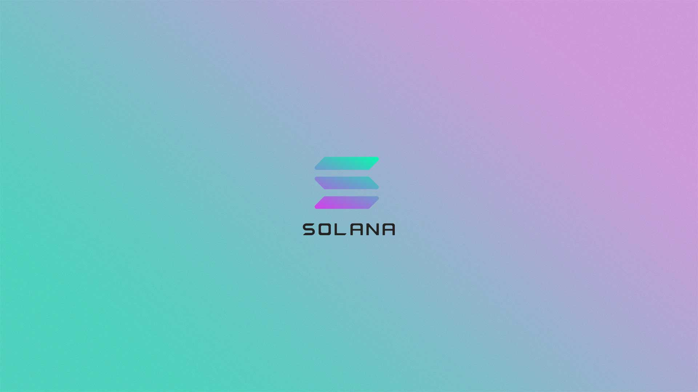

# Sol Swap

Making a transaction on blockchain requires public address of the receiver, but what if you have hundreads of contacts. You are not going to copy paste everytime, every single one of them right? 

So, to overcome this I have made this mobile application which offers solution for this problem, User can save the contact details PubKey and Name alias to the key and then user can check the contact details for future reference.

## Demo
<p float="left">
  

</p>

Sol Swap is a flutter application that allows users to make transactions and sign message and transaction through phantom wallet. User can store the contact details so, In future they don't have to search for public address to make transaction. For making transaction on Sol Swap In reward, a exclusive Solana NFT will be dropped to the user's wallet address. User don't have to pay anything to claim NFT, as NFT is already available in air drop.

## What I built

I have built mobile application using flutter. I have used Phantom Connect
SDK and deep linking to connect **Solana** Wallet [Phantom](https://phantom.app/) with flutter app. To create airdrop on solana, I have used [thirdweb](https://thirdweb.com/). I have used [Firebase](https://firebase.google.com/) for storing the contact details of the users. I have built API to claim NFT using **thirdweb SDK**. I have used [Solana JSON RPC API](https://docs.solana.com/developing/clients/jsonrpc-api) for communicating with Solana blockchain,
and [CoinCap](https://docs.coincap.io/) open source APIs for Asset information of 24H.

## Getting Started with Flutter

If this is your first flutter project. I would suggest you to first explore the basic concepts of [Flutter](https://docs.flutter.dev/cookbook).

otherwise you can clone this repo from here,
```sh
git clone https://github.com/rkmonarch/Sol-Swap
```
after clonning the repo run this command to install all required packages,
```sh
Flutter pub get
```
Once the packages are installed connect your device and run project by,
```sh
Flutter run
```
If you don't have [Phantom Wallet](https://phantom.app/) install it first.
Now when you have all the dependencies and project running you have to run the thirdweb collection API, Make your collection on [Third-Web](), and copy the collection ID and paste it in Index.js 
Once the packages are installed connect your device and run project by,
```sh
cd third-web
```
Install node packages by,
```sh
npm i
```
Once you replace the your Private Key and Collection ID use this command to start localhost
```sh
node index.js
```
### Note
don't forget to change the IP Address in Repository/Nft_repository for claiming the NFT

### About Solana

Solana provides a decentralized network which currently offers a transaction rate of 65,000 per second. Along with the high TPS, the transaction fees is also remarkably less.
Decentralized and secure Not only is Solana ultra-fast and low cost, it is censorship resistant. The Solana network is spread over thousands of independent nodes.
